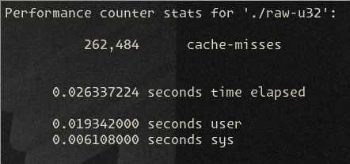
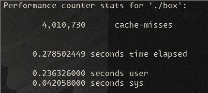

# caching
This exploration houses two folders: 'box' and 'raw-u32'. These are two implementations of a piece of code that increments one million (1,000,000) integers. The only difference is that 'raw-u32' uses a `Vec<32>` whereas 'box' uses `Vec<Box<u32>>`.  

Memory caching is often brought up in programming circles (see Casey Muratori, Coding Jesus, Tsoding) and in academic literature (Computer Systems: A Programmer's Perspective). I understood that it *should* make things faster, but a lot of questions remained...  

I wanted to accomplish a few things here.  
1. I wanted to prove that memory caching exists outside of textbooks.
2. I wanted to see the actual speed benefits of memory caching.
3. I wanted to know how to benchmark memory caching.

# Hypothesis
I was confident that the `Box<u32>` implementation would be slower. A `Box` is really just a (smart) pointer, so the ultimate location in memory of the `u32` is in an essentially random location; the pure `u32` implementation sits contiguously in memory. When the CPU reads the cache line (probably 64 bits), it's going to hit several `u32` at once and pre-fetch other `u32`.

# Actions
After wrangling cargo workspaces for a bit, I wrote the code and used `perf stat` to benchmark the code. Running this command will yield something like this:  
  

After some googling and checking the `help` instructions, I found the `-e` flag with `cache-misses` that shows exactly what I was interested in.

# Results
The `u32` implementation results in much fewer cache misses than the `Box<u32>` implementation. Was anyone surprised?  

The difference is actually pretty huge:
 

# Take-aways
This is an extremely simple example but it does, I think, demonstrate that designing your data structures to be cache friendly is important in a hot path. You wouldn't want anything like the `Box<u32>` example running there!  

I also ran `cargo asm` with both of the `add_one` functions in `box` and `raw-u32` binaries respectively. Taking a look at the resulting assembly shows that the `raw-u32` version uses the `MOVDQU` and `PSUBD` instructions.  

These are apparently SIMD (Single Instruction Multiple Data) instructions that operate on, well, multiple pieces of data with a single instruction. We can say that the loop has been 'vectorized' when this happens.  

One more interesting detail to note is that `PSUBD` is actually a subtraction instruction, when our loop was incrementing. Why is that? If we take a look at the resulting assembly, we can see that `PSUBD` is using xmm registers 1 and 0. Above the `MOVDQU` instructions we can also see that the `pcmpeqd` instruction targets xmm0. The `pcmpeqd` instruction performs a comparison between two sets of bytes, setting them to all 1s if equal. Since `pcmpeqd` compares xmm0 against itself, this yields -1 in signed 32bit integers, which is then subtracted (added) to the integer in our loop. It seems that this is a single instruction way of setting up for the increment, making it more efficient than 'real' addition.    

Pretty cool stuff.
